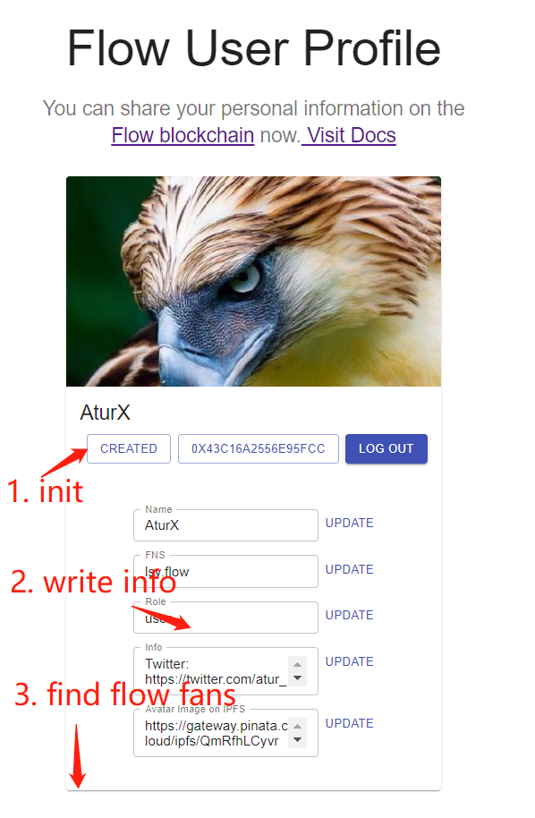

# Flow App Quickstart

[Chinese](./README-zh.md) | [English](./README.md)
 

This project through the official [flow-app-quickstart](https://docs.onflow.org/flow-js-sdk/flow-app-quickstart#extra-credit---adding-an-interface-that-uses-our-functions) to rebuild the latest version of the dApp.
Due to version iteration, the latest version deployment process in the test network through `Flow CLI` becomes easier and simpler. However, some codes in the official document are outdated, leading to the failure of `Cadence` contract to run, and there are also some differences in the call to `Flow FCL`.Alchemy is already available for dApp development.Therefore, the whole process and problems encountered are summarized here and the `Demo` is updated to help new Flow developers get started quickly.


The Demo:  [visit](https://flowfans.on.fleek.co/) 



1. The user needs to create a Profile Resource in his/her account: click the `INIT` page
2. Users can modify their personal information respectively and record it in Flow Blockchain
3. Users can see other users who add information on the Flow blockchain


# Boot/Dependency

- start 

```
cd web 
yarn install 
yarn start
```

- Wallet 

[Blocto](https://blocto.portto.io/)

[Blocto Wallet Doc](https://docs.blocto.app/blocto-sdk/flow)

- UI

[material-ui](https://material-ui.com/)

- API 

[alchemy](https://www.alchemy.com/)

[alchemy doc](https://docs.alchemy.com/flow/guides/getting-started)

- IPFS 

[Pinata](https://pinata.cloud/)

# 1. Preparation of knowledge

## Flow Blockchain Browser (Testnet, Mainnet)


1. Test web browser usage (temporarily) :
- Enquire accounts and contracts
```
// testnet
https://flow-view-source.com/testnet/account/0xb8daf9d5dad74056

// mainnet 
https://flow-view-source.com/mainnet/account/0xe041a498afccd00c
```

- Inquire Transaction Records
```
https://flow-view-source.com/testnet/tx/993e8c7a146f9f50183cb27d5030532254facec88d3fa59cc3402258d4103540

https://flow-view-source.com/mainnet/tx/993e8c7a146f9f50183cb27d5030532254facec88d3fa59cc3402258d4103540
```


It is recommended to use the following mainnet browser to view 👇 for mainnet information
Main Web Visualization Browser:
```
https://flowscan.org/
```


2. Flow node selection (Alchemy is recommended)

Your 'dApp' needs to interact with the smart contract and initiate transactions, which in traditional development, you only need back-end programs to do.
But in a blockchain, you have to interact with nodes in the network, and building your own nodes is expensive and not a recommended option.So, we have the following options for developing on 'Flow' 👇 :

[Node information provided in the official Flow website](https://docs.onflow.org/access-api/)：

- Mainnet: https://access.mainnet.nodes.onflow.org:9000
- Testnet: https://access.devnet.nodes.onflow.org:9000

[Node information provided by the Alchemy platform](https://docs.alchemy.com/flow/guides/getting-started)：

- Mainnet: https://flow-mainnet.g.alchemy.com
- Testnet: https://flow-testnet.g.alchemy.com
 
Note: `flow.json` is usually configured without adding `https://`
In this example, we recommend the official node for contract deployment and the service provided by [Alchemy](https://www.alchemy.com/) for dApp interaction. The platform has efficient service and clear panel to help us view the information about 'dApp'.


# 2 Account creation and token collection
Before you can officially start developing the FLOW smart contract, you need to have an account on the main network or test site.In addition, you need to have some 'Flow Token' in your test account, which will consume the 'Flow Token' during smart contract deployment.

**Account creation and token collection**works like this: you first need to generate a `key pair`，locally, which contains the `public key` and the `private key`。The `public key` is provided to [Flow TestNet Faucet](https://testnet-faucet-v2.onflow.org/), which helps you create a complete `address` (address!= public key).You then provide an address like `0xabcdef12345689` to [Flow TestNet Faucet](https://testnet-faucet-v2.onflow.org/) to receive the test Flow Token.

  
1. Create the key pair locally
- Install `Flow CLI` 
First of all, we need to [the official tutorial installation Flow CLI](https://docs.onflow.org/flow-cli/install/), it is a Flow of command line tools, it can help you through the command line mode, the most complete and block the operation of chain interaction.
Execute the following command to create the `key pair` :
```
flow keys generate
```

The following results were obtained:
```
 Store private key safely and don't share with anyone! 
Private Key      a2df7ec91b9b3d65dced51f9d37494397d2233f37fb183303b.....
Public Key       20a3fcf4377a8a4f32a146db3178ae31cd72d50d6fbc0c517d19ab36bc791931dd75e51961a6f63559d09ed29528ac793357e91a7d1fa410ea1b5f1f92c1e7db
```
** Note: The above is the test address, anyone can use it.* * ☝ ️
 
 
2. Create the test account address
Go to [TestNet Faucet](https://testnet-faucet-v2.onflow.org/), fill in your Public Key (Public Key is the long Key), everything else is the default, and click Create Account.
After waiting some time, you will be able to get your test account address like:
```
0x8f8f12c1c5ba67e9
```

Use `Flow CLI` to see the address information:
```
flow accounts get 0x8f8f12c1c5ba67e9 --network testnet
```
As you can see, 1000 `Flow tokens` have been pre-stored in this address. If more `Flow tokens` are needed for the following operations.

 

3. Address to collect test tokens
Fill in your address in the second input box. After completing the verification code, click `Fund Account` to receive 1000 test  `Flow Token`.
Summary:
The account creation and token collection section, we are finished.
We have mastered:
- Create the Flow key pair locally
- Use the public key to create a Flow account
- Get the test Flow Token by account address
  
Next, let's look at how to write a Cadence smart contract online, and then do the project creation and contract deployment test network locally.

 
# 3 Cadence Smart Contracts

1. Cadence contract writing
Flow state to provide an online development and write on [Playground](https://play.onflow.org/), in order to quickly validation of feasibility of [Cadence合约](https://docs.onflow.org/cadence/),It is suggested that we directly develop the `Cadence` contract through the `Playground`, and further deploy it locally with the Flow CLI after confirming that the logic is completed and the contract can be successfully compiled.

 
2. Cadence project creation
If you've already written and compiled contracts on the `Cadence Playground`, you've already found that `Cadence` consists of three parts: `Contract` 、`Script` 、`Transaction`
`Contract` is the smart Contract we actually need to deploy, and `Script` and `Transaction` are the ways we interact with the smart Contract (functions).
Execute the following command to initialize the current directory as the `Contract` project:
```
flow init 
```
  
You will then notice that the current directory generates a `flow.json` file that contains some basic contract deployment information:

- emulators
Configuration information of the local Flow blockchain simulator. It is recommended to use the test network directly for contract deployment.

- contracts
Configure the path and information for the Cadence contract.The `FungibleToken` and `NonFungibleToken` recommendations already deployed in the Flow network can be configured directly as the default parameters.

- networks
Configure the main deployed network and related information.Use the default generated address when deploying the contract.

- accounts
The account `address` and `private key` used to deploy the smart contract should be noted that the `private key` cannot be publicly exposed and should be stored in the file `.env` for reading.This is for demonstration purposes only, so fill in (but this is not a safe way to write it).


The right thing to do:
```
"testnet-account": {
      "address": "${FLOW_ADDRESS}",
      "keys": "${FLOW_PRIVATE_KEY}"
    }
```

The wrong thing to do:
```
"testnet-account": {
      "address": "8f8f12c1c5ba67e9",
      "keys": "a2df7ec91b9b3d65dced51f9d37494397d2233f37....."
    }
```
**Note: `address` does not need to be prefixed with `0x`.**

- deployments
Multiple networks can be configured, and multiple contracts can be filled out, and the names of the contracts will be the names provided in the `contracts` section above.


So here's my complete `flow.json` configuration:
```
{
	"emulators": {
		"default": {
			"port": 3569,
			"serviceAccount": "emulator-account"
		}
	},
	"contracts": {
		"HelloWorld": "./cadence/contracts/HelloWorld.cdc",
		"FungibleToken": {
			"source": "./cadence/contracts/FungibleToken.cdc",
			"aliases": {
			  "emulator": "0xee82856bf20e2aa6",
			  "testnet": "0x9a0766d93b6608b7"
			}
		},
		"NonFungibleToken": {
			"source": "./cadence/contracts/NonFungibleToken.cdc",
			"aliases": {
			  "testnet": "0x631e88ae7f1d7c20"
			}
		}
		
	},
	"networks": {
		"emulator": "127.0.0.1:3569",
		"mainnet": "flow-mainnet.g.alchemy.com",
		"testnet": "flow-testnet.g.alchemy.com"
	},
	"accounts": {
		"emulator-account": {
			"address": "f8d6e0586b0a20c7",
			"key": "1d78a879cae624026e38693238c98ed4e110a8a6e5a35f5d0719d0c0758675f3"
		},
		"testnet-account": {
			"address":"8f8f12c1c5ba67e9", 
			"keys": "a2df7ec91b9b3d65dced51f9d37494397d2233....."
		}
		
	},
	"deployments": {
		"testnet": {
			"testnet-account": [
			  "HelloWorld"
			]
		  },
		  "emulator": {
			"emulator-account": [
			]
		  }
	}
}
```
 
3. Contract deployment
First, a deployment of the `HelloWorld.cdc` contract is performed to demonstrate the complete deployment process.


When you are finished with your Cadence contract, fill out the `flow.json` configuration file and deploy it using the following command:
```
flow project deploy --network=testnet
```


After successful deployment, similar message appears:
```
Deploying 1 contracts for accounts: testnet-account

HelloWorld -> 0x8f8f12c1c5ba67e9 (6b7bc1cac8fe865ec4b23db5d835a99b47cae8fcb9130921065916dfcc7b533f)


All contracts deployed successfully
```

At this time, we can test the network block browser or use the Flow CLI to check, and we can see that we successfully deployed the contract.
```
https://flow-view-source.com/testnet/account/0x8f8f12c1c5ba67e9

flow accounts get 0x8f8f12c1c5ba67e9 --network testnet
```
**Note: 😵 test web browser `address` must add `0x`**


 
Deploy the `Profile.cdc` section:
1. Once you've completed most of the Cadence contracts in Playground, place them in the project folder Cadence and divide them by type.

[Playground code reference](https://play.onflow.org/501caf65-3db6-4dc7-a2f6-2e0ae875cec9?type=tx&id=47f4e8e2-632f-4fbd-a53a-6515b9edd208)：
https://play.onflow.org/501caf65-3db6-4dc7-a2f6-2e0ae875cec9?type=tx&id=47f4e8e2-632f-4fbd-a53a-6515b9edd208


```
cadence
    - contracts
    - scripts
    - transactions
```

2. Configure the information for the new contract `Profile.cdc` in `flow.json`.
Perform an update to an already deployed contract and deploy a new one:
```
flow project deploy --network=testnet --update
```


The following results indicate successful deployment:
```
Deploying 2 contracts for accounts: testnet-account

HelloWorld -> 0x8f8f12c1c5ba67e9 (0e571ad01fb00ea00f90771d124f4b5b11ccf19a8862f1a742084871425cf4ac)

Profile -> 0x8f8f12c1c5ba67e9 (851bd8f3c176ead30b58a63f0cf5f9ae0709cc40d330573e709daf02b553fb9b)


 All contracts deployed successfully
```

 
At this point,We can replace the `Profile` address in both `scripts` and`transactions` with `0x8f8f12c1c5ba67e9`, because we are deploying addresses like `0x01` or  `0x02` and in `Playground`, these are not the actual deployment addresses in the Flow test network.


Verify our contract deployment:
```
https://flow-view-source.com/testnet/account/0x8f8f12c1c5ba67e9

flow accounts get 0x8f8f12c1c5ba67e9 --network testnet
```


Summary:
So that's the Cadence smart contract part.
We have mastered:
- Local Cadence projects are created in the directory structure
- `flow.json` details configuration
- Use of playground and contract writing debugging
- Local `Flow CL`I` for Cadence contract deployment to the test network
- Test the contract deployment by the test browser
Let's take a look at how a call to a Cadence contract interacts with a front-end page in a dApp.


# 4. FCL Usage and Contract Interaction

1. Create a Web project and add necessary dependencies

```
yarn create react-app my-app
cd my-app
yarn add @onflow/fcl @onflow/types
```
 
- @onflow/FCL is responsible for converting the Cadenced code such as `scripts` and `transactions` we created above into a form that `JavaScript` can call and includes the ability to interact with the blockchain.

- @onflow /types is responsible for converting the data types in our `JavaScript` to the types identified in CADENCED such as  `scripts` and `transactions` created above.

 

2. Configuration file Settings
After the above process, we have obtained the Flow account number, private key, contract address after deployment and other information. We need to record them in the configuration file `config.js` in the dApp, so that `fcl` can read them when interacting with the blockchain.
 
However, since the private key and other information are very sensitive and can not be exposed, we also need to create a `.env` file to save sensitive data, and then`config.js` to read in`.env`, and we will not publish.If your DApp is deployed on [fleek](https://fleek.co/), you can add environment variables to the configuration page.

```
touch .env.local        # Create a .env.local file to store our environment variables
touch ./src/config.js   # Create a ./src/config.js file where we will import our environment variables and configure FCL
```
 
Refer to the documentation of `Alchemy` to configure your node information: `REACT_APP_ALCHEMY_API_KEY` requires you to register and create it on the website.(The key I provided is only for demonstration, and may become invalid at any time)

Complete configuration of `.env`:
```
# File: .env.local

# REACT_APP_ACCESS_NODE will be the Alchemy endpoint for our application
# REACT_APP_ALCHEMY_API_KEY is your unique Alchemy API key.
REACT_APP_ACCESS_NODE= https://flow-testnet.g.alchemy.com
REACT_APP_ALCHEMY_API_KEY= "7f1rfypcs16b113s2xc8doxdunmgv5ls"

# WALLET_DISCOVERY will be the endpoint our application
# will use to discover available FCL compatible wallets.
REACT_APP_WALLET_DISCOVERY= https://fcl-discovery.onflow.org/testnet/authn

# CONTRACT_PROFILE will be the address that has the Profile
# smart contract we will be using in this guide.
REACT_APP_CONTRACT_PROFILE= 0x8f8f12c1c5ba67e9

```
 
Next, go to configure `config.js`. The full configuration is as follows:
```
// File: ./src/config.js
import * as fcl from "@onflow/fcl"

fcl.config()
  .put("grpc.metadata", {"api_key": process.env.REACT_APP_ALCHEMY_API_KEY})
  .put("accessNode.api", process.env.REACT_APP_ACCESS_NODE) // Configure FCL's Alchemy Access Node
  .put("challenge.handshake", process.env.REACT_APP_WALLET_DISCOVERY) // Configure FCL's Wallet Discovery mechanism
  .put("0xProfile", process.env.REACT_APP_CONTRACT_PROFILE) // Will let us use `0xProfile` in our Cadence
```

3. FCL realizes authorization and login

 

Because the account system of Flow is different from that of Ethereum, MetaMask and other implementations are not adopted when authorizing login.But [Use Blocto Wallet to log in](https://docs.blocto.app/blocto-sdk/flow/login-register)  is recommended for the Flow dApp.

 
In `auth-cluster.js`, let's complete:

- Login/Register
`fcl.currentUser().subscribe(setUser)`  Subscribe the login status of the user
`fcl.currentUser().unauthenticate()` determines whether the currentUser is authorized, short for  `fcl.unauthenticate()`
`fcl.logIn()`  and `fcl.signUp()` represent the logIn and registration functions, respectively, but currently in Flow's wallet, both behave the same.Equivalent to `fcl.currentUser().authenticate()`.
  
- cancellation
Unsubscribe from the `fcl.unauthenticate()` function to change the user's login status.
 

4. Check if the user initializes the Flow Profile
  
We deploy `Profile` contract here: https://flow-view-source.com/testnet/account/0x8f8f12c1c5ba67e9/contract/Profile
The procedure for calling `Cadence scripts` in `Flow FCL` is as follows: `fcl.send([]).then(fcl.decode)`.

 
Interacting with a blockchain is divided into three processes: constructing a transaction, signing a transaction, and broadcasting a transaction

In the array part of `fcl.send([])`, we build our own transaction information and read the information from the configuration file to sign it.
`fcl.decode` will parse the return value from our script and convert it to a JavaScript value.


- The implementation that monitors whether the account is initialized: `is-initialized.script.js`


```
import * as fcl from "@onflow/fcl"
import * as t from "@onflow/types"

export async function isInitialized(address) {
  if (address == null)
    throw new Error("isInitialized(address) -- address required")

  return fcl
    .send([
      fcl.script`
        import Profile from 0xProfile

        pub fun main(address: Address): Bool {
          return Profile.check(address)
        }
      `,
      fcl.args([fcl.arg(address, t.Address)]),
    ])
    .then(fcl.decode)
}
```

 

If the user Profile already exists, you can continue to query the information by reading the information.
- Complete implementation of query Profile information: `fetch-profile.script.js`

```
import * as fcl from "@onflow/fcl"
import * as t from "@onflow/types"

export async function fetchProfile(address) {
  if (address == null) return null

  return fcl
    .send([
      fcl.script`
        import Profile from 0xProfile

        pub fun main(address: Address): Profile.ReadOnly? {
            return Profile.read(address)
        }
      `,
      fcl.args([fcl.arg(address, t.Address)]),
    ])
    .then(fcl.decode)
}
```
  
Because of the address where the Profile contract is deployed, we have recorded it in the configuration file `config.js`, so we only need to use `0xProfile` instead of `0x8f8f12c1c5ba67e9`
Since the user information is not initialized for the first time using the dApp, you need to initialize the user Profile information.
Initializing the Profile information requires us to initiate the `transactions` transaction, which is different from the two `scripts` transactions above.It requires user signature authorization and requires different parameters.
- Full implementation for initializing the account: `init-profile.tx.js`


```
import * as fcl from "@onflow/fcl"
// import * as t from "@onflow/types"

export async function initProfile(address) {
  console.log(address)
  console.log(fcl.currentUser().authorization)
  const txId = await fcl
    .send([
      fcl.proposer(fcl.currentUser().authorization), // current user acting as the nonce
      fcl.authorizations([fcl.currentUser().authorization]), // current user will be first AuthAccount
      fcl.payer(fcl.currentUser().authorization), // current user is responsible for paying for the transaction
      fcl.limit(135), // set the compute limit
      fcl.transaction`
      import Profile from 0xProfile

      transaction {
          // We want the account's address for later so we can verify if the account was initialized properly
          let address: Address
      
      prepare(currentUser: AuthAccount) {
          // save the address for the post check
          self.address = currentUser.address
      
          // Only initialize the account if it hasn't already been initialized
          if !Profile.check(self.address) {
              // This creates and stores the profile in the user's account
              currentUser.save(<- Profile.new(), to: Profile.privatePath)
      
              // This creates the public capability that lets applications read the profile's info
              currentUser.link<&Profile.Base{Profile.Public}>(Profile.publicPath, target: Profile.privatePath)
          }
          }
          
          // verify that the account has been initialized
          post {
          Profile.check(self.address): "Account was not initialized"
          }
      }
      `
    ])
    .then(fcl.decode)

  return fcl.tx(txId).onceSealed()
}
```
  
Note: Insufficient limit value will cause an error.`proposer`、`authorizations`、`payer`  should be executed in order.

Knowledge about the system Flow wallet account can view: [Accounts, Keys & Signing](https://docs.onflow.org/concepts/accounts-and-keys/) 

The configuration for wallets is also set in the `challenge.handshake` field of `config.js`.
Each `scripts` and `transactions` completes a similar process.Take a closer look at the files in `src/flow`, instead of breaking them down individually.

In addition, when I was about to finish the test, I changed the function of the Cadence contract once, so I could not update the contract.
At this point, you can delete the original contract, redeploy it, and finally look at the block browser.But then the data won't be saved.

```
flow accounts remove-contract Profile --network testnet

flow project deploy --network=testnet --update

https://flow-view-source.com/testnet/account/0x8f8f12c1c5ba67e9

```
 
Note that the command reads the configuration information of the `flow.json` file, but the address of the `accounts` it executes is always the information recorded in the `emulator-account`. I can't find a suitable way to call the `testnet-account`.
One lazy way to do this is to replace the contents of `emulator-account` with those of `testnet-account`.

However, you find that you cannot redeploy a new contract because `stores` contains a contract with the same name. Change the contract name to solve this problem.
I changed both the Profile and Cadence file `Profile` to '`Profile1`.However, if the variable parameters are too many, it is recommended to directly deploy to another address.(I haven't found a good way yet)

# 5 Flow DApp front-end development and user interaction

With the basic interaction above, we then need to complete React's management of various states in contract interaction.
By reacting to this reaction, we can learn more about how to React.
```
web/flow
web/hooks
web/components
```

See more details: [flow-app-quickstart](https://docs.onflow.org/flow-js-sdk/flow-app-quickstart#extra-credit---adding-an-interface-that-uses-our-functions)


- More 

[awesome-flow](https://github.com/FlowFans/awesome-flow)


